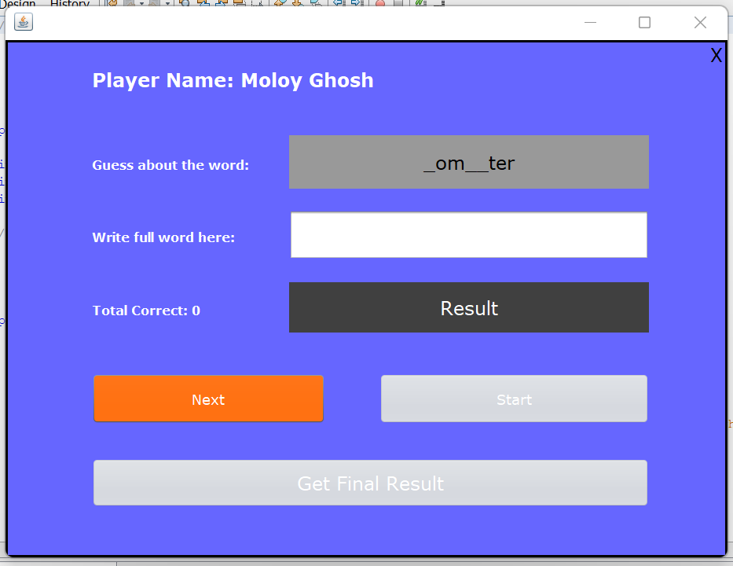

This is a word guessing game I developed.  I wrote the code myself. Although I received some guidance from online resources to know some java swing method like how can pass data from one UI to another UI.

 To run this app on your computer on NetBeans take "BillingSystem" folder from here and keep it in your computer's "NetBeansProjects" folder.

 

First UI: This is a welcome page. Write your name and click "Play game"

 

Second UI: Your will see some buttons are disabled, and you can also see your name.

Second UI: After clicking "Start" you will this. You have to guess the word and you have to write it and next you have to click "Next"

Second UI: After clicking "Next" you will see your previous guessing was correct or worng. See this screenshot... it was "correct"! 

Second UI: Oh! But this was wrong!

Second UI: And after 10 words, you will see that "Next" button is disabled but other two buttons are enabled. You can play again clicking "Start again" button. But to get result...

 

Third UI: If you click "Get final result" from second UI you will get this, where you can see your result! 

 

Thank you

